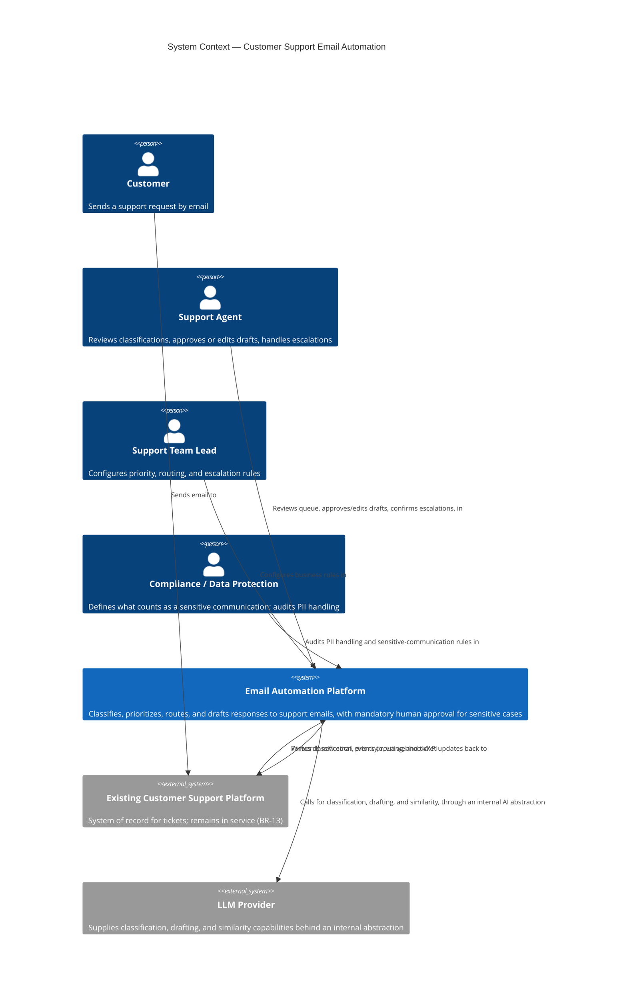
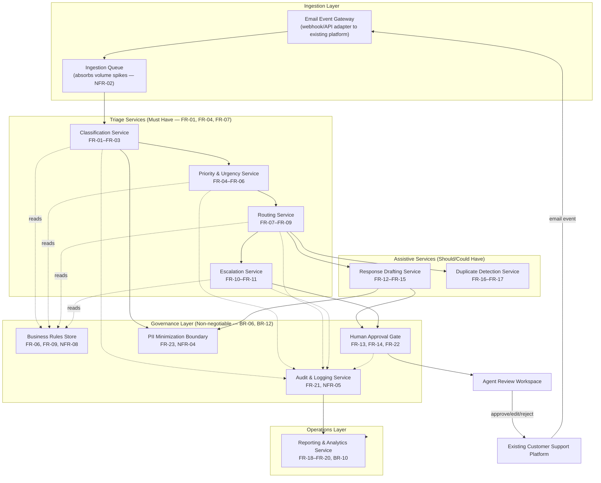
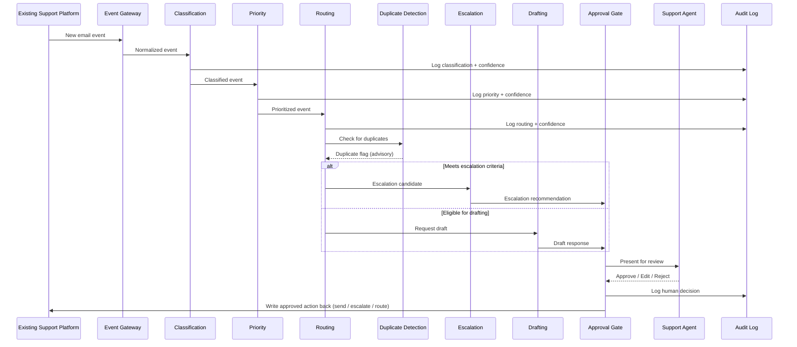

# Solution Architecture — Customer Support Email Automation

| Property            | Value                                                                                                     |
| -------------------- | ------------------------------------------------------------------------------------------------------------ |
| Case Study            | [Customer Support Email Automation](../README.md)                                                         |
| Work Order            | [WO-103 — Customer Support Solution Architecture](../../../work-orders/delivery/WO-103-Customer-Support-Solution-Architecture.md) |
| Source Requirements   | [Requirements Specification](../requirements/requirements-specification.md)                                |
| Source Discovery      | [Discovery Document](../discovery/discovery-document.md)                                                   |
| Prepared By           | Solution Architect                                                                                          |
| ACM Phase             | Create                                                                                                       |
| Status                | Draft — Pending Client Review                                                                                |
| Version               | 1.0                                                                                                           |
| Date                  | 2026-08-03                                                                                                    |

---

## Table of Contents

- [1. Executive Summary](#1-executive-summary)
- [2. Architecture Objectives](#2-architecture-objectives)
- [3. Architectural Drivers](#3-architectural-drivers)
- [4. Guiding Principles](#4-guiding-principles)
- [5. System Context](#5-system-context)
- [6. Logical Architecture](#6-logical-architecture)
- [7. AI Architecture](#7-ai-architecture)
- [8. Data Flow](#8-data-flow)
- [9. Integration Strategy](#9-integration-strategy)
- [10. Security Architecture](#10-security-architecture)
- [11. Deployment Strategy](#11-deployment-strategy)
- [12. Scalability Strategy](#12-scalability-strategy)
- [13. Observability](#13-observability)
- [14. AI Governance](#14-ai-governance)
- [15. Architecture Decision Record (ADR) Summary](#15-architecture-decision-record-adr-summary)
- [16. Risks and Trade-offs](#16-risks-and-trade-offs)
- [17. Engineering Handoff](#17-engineering-handoff)

---

## 1. Executive Summary

This Solution Architecture translates the [Requirements Specification](../requirements/requirements-specification.md) — 13 business requirements, 23 functional requirements, and 10 non-functional requirements, all traced to the [Discovery Document](../discovery/discovery-document.md) — into an implementation-ready architectural blueprint for the Customer Support Email Automation engagement.

The architecture introduces an **event-driven triage pipeline** that sits alongside the client's existing customer support platform rather than replacing it (BR-13, NFR-10). Incoming email events are classified, prioritized, and routed by AI-assisted services; urgent and high-risk cases are flagged for expedited handling; and every customer-facing response — whether AI-drafted or agent-written — passes through a **mandatory human approval gate** before it is sent (BR-06). Personally identifiable information is protected throughout the pipeline through minimization, access control, and encryption (BR-12).

Two forces shape every major decision in this document: the two **non-negotiable requirements** carried forward from Discovery and Requirements (mandatory human approval, PII protection), and the fact that several **business rules and baseline metrics remain undefined** at the time of this architecture (see [Requirements Specification §7](../requirements/requirements-specification.md#7-business-rules) and [§13](../requirements/requirements-specification.md#13-open-questions)). Where a decision depends on one of these open items, this document says so explicitly rather than assuming an answer.

This architecture is **technology-aware, not technology-agnostic**: it builds on the technology direction already stated in the case study's [Technology Direction](../README.md#technology-direction) (Claude as the underlying LLM, Spring Boot, React, PostgreSQL, Docker, AWS, GitHub Actions, RAG, REST APIs), while abstracting the AI provider and business-rule logic behind interfaces so that neither is hard-wired into the pipeline. **No source code or cloud infrastructure code is included** — those belong to the Engineering phase that follows this Work Order.

---

## 2. Architecture Objectives

Each objective below is the architectural restatement of a business requirement from the Requirements Specification; the architecture exists to satisfy these, not the reverse.

| Objective                                                                    | Traces to     |
| -------------------------------------------------------------------------------- | ---------------- |
| Reduce first response time through automated first-pass triage                     | BR-01           |
| Classify every incoming email automatically                                        | BR-02           |
| Detect priority and urgency automatically, including high-risk cases               | BR-03           |
| Route requests to the correct team with improved accuracy                          | BR-04           |
| Draft responses for agent review to reduce manual drafting time                    | BR-05           |
| Guarantee human approval before any sensitive communication is sent                | BR-06 (non-negotiable) |
| Support measurable improvement in Customer Satisfaction (CSAT)                     | BR-07           |
| Reduce the fully loaded cost of handling each ticket                                | BR-08           |
| Increase the proportion of agent time spent on complex, high-value work            | BR-09           |
| Provide reliable operational reporting                                              | BR-10           |
| Identify potential duplicate or repeat inquiries                                    | BR-11           |
| Protect personally identifiable information throughout the process                 | BR-12 (non-negotiable) |
| Operate alongside, without replacing, the existing support platform                | BR-13           |

---

## 3. Architectural Drivers

The following forces most strongly shape the shape of this architecture:

| Driver                                                                          | Architectural Consequence                                                                                  |
| ------------------------------------------------------------------------------------ | ------------------------------------------------------------------------------------------------------------- |
| Two non-negotiable requirements (BR-06, BR-12)                                        | A mandatory approval gate and PII-minimization boundary are architectural invariants, not optional features, and appear at every layer that touches customer communication or PII. |
| Volume and burstiness (~8,000 emails/day, with unmeasured peak spikes — NFR-02)         | Ingestion must be decoupled from processing via an asynchronous, queue-based pattern so spikes don't cause backpressure failures. |
| Business rules not yet defined (priority, routing, escalation criteria — see [Requirements §7](../requirements/requirements-specification.md#7-business-rules)) | Priority, routing, and escalation logic must be externalized into a configurable rules component (FR-06, FR-09, NFR-08), not embedded in service code. |
| Baseline performance metrics not yet available (FRT, ART, CSAT, cost — NFR-01)          | Performance NFRs are architected for headroom and instrumentation rather than a fixed numeric SLA; the observability layer exists partly to *produce* the missing baselines. |
| Continuity constraint — existing support platform(s) remain in service (BR-13, NFR-10)  | The system integrates as an additive service via API/webhook, not a platform replacement; no assumption is made about decommissioning anything the client currently runs. |
| Technology direction already declared in the case study (Claude, Spring Boot, React, PostgreSQL, Docker, AWS, RAG) | The architecture adopts this direction as its default technology context but isolates the AI provider and the business-rules store behind interfaces, consistent with the persona principle to "remain technology-neutral until justified." |

---

## 4. Guiding Principles

These principles, drawn from the [Solution Architect persona](../../../personas/solution-architect.md#architecture-principles), govern every design choice in this document:

- **Business-driven.** Every component exists to satisfy a specific requirement ID; none is included for its own sake.
- **Technology-neutral until justified.** Where the case study's stated Technology Direction is adopted, it is adopted because it fits the requirement, not by default — and it is isolated behind an interface so it can be replaced without re-architecting.
- **Minimal necessary complexity.** No component is introduced unless a requirement demands it (e.g., no separate service is proposed for Should-/Could-Have capabilities that can share infrastructure with a Must-Have one).
- **Modular evolution.** Services are independently deployable so that, for example, response drafting (Should Have) can be paused or replaced without affecting classification (Must Have).
- **Protect sensitive data by default.** PII handling is a cross-cutting concern applied uniformly, not a feature of any one service.
- **Observability is built in, not bolted on.** Every service emits the telemetry needed to populate the Success Metrics defined in the Requirements Specification.
- **Human oversight is structural.** The approval gate is a component in the architecture, not a policy note — it cannot be bypassed by a code path that forgets to check it.

---

## 5. System Context

The system is a new **Email Automation Platform** that sits between the client's inbound email channel and its existing support agents, integrating with — not replacing — the existing customer support platform.

**Boundary note:** the Email Automation Platform never sends a customer-facing email directly for a sensitive case (FR-14) — it only ever hands a draft or a decision back to the existing support platform or to a human agent for action, so the client's existing customer-facing channel and its audit trail remain the system of record.

---

## 6. Logical Architecture

The platform is decomposed into independently deployable services, grouped by the capability groups already established in the Requirements Specification.

### Component Responsibilities

| Component                        | Responsibility                                                                                      | Requirement Trace                     |
| ------------------------------------- | ------------------------------------------------------------------------------------------------------- | ----------------------------------------- |
| Email Event Gateway                    | Receives inbound email events from the existing platform via webhook/API; normalizes them for the pipeline | Supports BR-13, NFR-10                     |
| Ingestion Queue                        | Buffers events between intake and processing to absorb volume and demand spikes                          | NFR-02                                     |
| Classification Service                 | Assigns an issue category; flags low-confidence results for manual review                                | FR-01, FR-02, FR-03                        |
| Priority & Urgency Service              | Assigns a priority level using rules from the Business Rules Store; flags urgent/high-risk cases          | FR-04, FR-05, FR-06                        |
| Routing Service                        | Assigns the correct team/queue using rules from the Business Rules Store; flags low-confidence routing   | FR-07, FR-08, FR-09                        |
| Escalation Service                     | Recommends escalation for high-risk/urgent cases; requires human confirmation before executing            | FR-10, FR-11                               |
| Response Drafting Service               | Generates a draft response (RAG-grounded) for eligible requests                                          | FR-12, FR-15                               |
| Duplicate Detection Service             | Flags likely duplicate/repeat inquiries as advisory information                                            | FR-16, FR-17                               |
| Business Rules Store                    | Holds priority, routing, and escalation criteria as business-owned, versioned configuration                | FR-06, FR-09, NFR-08                       |
| Human Approval Gate                     | Enforces that no sensitive or AI-drafted communication is sent without explicit agent approval             | FR-13, FR-14, FR-22, BR-06                 |
| PII Minimization Boundary               | Limits PII exposure in every downstream interface and log to what the task requires                       | FR-23, NFR-04                              |
| Audit & Logging Service                 | Records every automated decision and human override for compliance and quality review                     | FR-21, NFR-05                              |
| Reporting & Analytics Service           | Produces volume, classification, routing, escalation, and automation-vs-baseline reporting                 | FR-18, FR-19, FR-20, BR-10                 |
| Agent Review Workspace                  | Where agents review classifications, approve/edit/reject drafts, and confirm escalations                   | FR-13, FR-15, NFR-07                       |

---

## 7. AI Architecture

AI capability is used in exactly four places, each scoped to the minimum needed to satisfy its requirement — this is a deliberate application of the "minimize unnecessary complexity" principle rather than a single monolithic "AI layer."

| Capability                  | AI Technique                                                                | Requirement | Human Oversight                              |
| -------------------------------- | -------------------------------------------------------------------------------- | ------------- | -------------------------------------------------- |
| Classification                    | LLM-based text classification against a defined category set                      | FR-01–FR-03  | Low-confidence results routed to manual review       |
| Priority / urgency detection      | LLM-based classification against business-defined priority criteria               | FR-04–FR-06  | Urgent/high-risk flags are advisory to a human queue |
| Response drafting                  | Retrieval-Augmented Generation (RAG) — LLM grounded against a support knowledge base | FR-12, FR-15 | Mandatory agent review and approval (FR-13, FR-14)   |
| Duplicate detection                | Semantic similarity search against recent open tickets                            | FR-16, FR-17 | Presented as advisory guidance only                  |

**Why RAG for drafting, not free-form generation:** grounding draft responses in a retrieved knowledge base reduces the risk of factually incorrect or off-policy content reaching a customer, which matters directly to BR-06 and BR-07 — an ungrounded model is more likely to produce a draft an agent must heavily rewrite or reject, undermining the productivity objective (BR-09) it exists to serve.

**AI Provider Abstraction:** every AI-backed component calls a single internal `AI Capability Interface` rather than a specific vendor SDK directly. The case study's stated direction is Claude as the underlying LLM; this architecture treats that as the initial implementation behind the interface, not a hard dependency baked into service logic. This satisfies the "technology-neutral until justified" principle and gives Engineering room to change providers, or use different models for different capabilities (e.g., a smaller/cheaper model for classification, a stronger model for drafting) without touching business logic.

**Confidence and abstention:** every AI-backed decision produces a confidence signal. Classification and routing use this to decide between "act automatically" and "flag for human review" (FR-02, FR-08) — the architecture treats abstention as a first-class outcome, not an error condition.

---

## 8. Data Flow

**PII handling along the flow:** raw email content (which may contain PII) is only ever visible to the services that need it to perform their specific task; the Audit & Logging Service stores decision metadata (category, priority, routing target, confidence, timestamps, human overrides) rather than full message content by default, and the Reporting & Analytics Service consumes only aggregated, de-identified data (FR-23, NFR-04). Full-content access for a specific ticket is available to an agent only through the existing support platform's own access controls, not duplicated inside the automation layer.

---

## 9. Integration Strategy

The platform integrates with the existing customer support platform through two contracts, keeping the existing platform as the system of record (BR-13, NFR-10):

1. **Inbound: Email Event Notification.** The existing platform notifies the Email Event Gateway of new inbound emails via webhook or polling API (the specific mechanism depends on what the existing platform exposes — see [Requirements Open Question 7](../requirements/requirements-specification.md#13-open-questions)). The gateway does not become a mail server; it consumes events from the platform that already receives the mail.
2. **Outbound: Action Write-back.** Approved actions (classification tags, priority, routing/queue assignment, approved draft ready to send, confirmed escalation) are written back to the existing platform through its API, so agents continue to work primarily inside the platform they already use.

**Why an additive integration rather than a replacement:** BR-13 and NFR-10 make replacing the existing platform out of scope; an additive, API-based integration is the only pattern consistent with "minimize disruption to current support operations" while still allowing the triage pipeline to intercept and accelerate the manual steps identified as pain points in Discovery.

**Integration risk:** this strategy depends on the existing platform exposing adequate webhook/API capability. Since the specific platform(s) in service were not identified during Discovery (Open Question 7), this is flagged as an assumption requiring validation before Engineering begins (see [Section 16](#16-risks-and-trade-offs)).

---

## 10. Security Architecture

Security architecture is organized around the two non-negotiable requirements and the NFRs that operationalize them.

| Control                                                                 | Purpose                                                                                  | Requirement Trace          |
| ---------------------------------------------------------------------------- | ----------------------------------------------------------------------------------------------- | ------------------------------- |
| Encryption in transit and at rest for all email content and derived data      | Protects PII throughout processing and storage                                                    | BR-12, NFR-04                    |
| PII minimization at every interface (classification, routing, reporting)      | Limits PII exposure to what each component's task requires, not the full message by default       | FR-23, NFR-04                    |
| Role-based access control                                                     | Restricts approval of sensitive communications and configuration of business rules to authorized roles | FR-22, NFR-06                    |
| Mandatory Human Approval Gate as an enforced architectural component          | Makes BR-06 a structural guarantee — no code path can send a sensitive/drafted response without passing through it | BR-06, FR-13, FR-14              |
| Immutable audit logging of decisions and overrides                            | Supports compliance review and quality audit                                                       | FR-21, NFR-05                    |
| Data retention policy enforcement (period TBD by Compliance)                  | Ensures email content and PII are disposed of per the client's obligations once defined            | NFR-09                            |

**Design note on the Approval Gate:** it is modeled as a shared component that every path to a customer-facing action (drafted response, escalation execution) must pass through, rather than a check duplicated inside each service. This is a deliberate security-by-architecture decision: a missing "if approved" check in one service cannot silently bypass governance, because there is no direct path from any service to the existing platform's send/escalate actions that does not go through the gate (see the Logical Architecture diagram in [Section 6](#6-logical-architecture)).

**Open item:** the formal definition of "sensitive communication" (Requirements Open Question 3) is a Compliance-owned business rule, not an architectural decision. The Approval Gate is built to *enforce* whatever definition Compliance provides via the Business Rules Store; it does not attempt to infer sensitivity itself.

---

## 11. Deployment Strategy

Consistent with the case study's Technology Direction, services are containerized (Docker) and deployed to a cloud environment (AWS), with delivery through GitHub Actions. This section describes the deployment *approach*, not infrastructure code or environment definitions — those are Engineering-phase artifacts.

- **Environment progression:** development → staging → production, with the staging environment used to validate integration with a sandbox/test instance of the existing support platform before any production write-back is enabled.
- **Independent service deployment:** each logical service ([Section 6](#6-logical-architecture)) is deployable independently, so a change to, for example, the Response Drafting Service does not require redeploying Classification or the Approval Gate.
- **Progressive rollout:** given BR-06's non-negotiable status, production rollout should enable read-only/shadow-mode triage first (classification and priority run and log results without acting), followed by human-approved routing, followed last by AI-assisted drafting — the same triage-before-drafting sequencing already recommended in the Requirements Specification's [Recommendations for the Solution Architect](../requirements/requirements-specification.md#15-recommendations-for-the-solution-architect).
- **Graceful degradation:** if any triage service is unavailable, the Event Gateway fails open to the existing manual process (i.e., the email remains in the existing platform's queue for manual handling) rather than blocking intake (NFR-03).

---

## 12. Scalability Strategy

| Concern                                             | Approach                                                                                     | Requirement Trace |
| -------------------------------------------------------- | -------------------------------------------------------------------------------------------------- | -------------------- |
| Sustained volume (~8,000 emails/day)                        | Stateless, independently scalable services behind the Ingestion Queue                               | NFR-02                |
| Demand spikes (peak volume not yet measured — Open Question 5) | Queue-based decoupling absorbs bursts without requiring services to be pre-sized for worst-case peak; autoscaling is driven by queue depth, not a fixed instance count | NFR-02                |
| Growth beyond current volume                                | Horizontal scaling of each service independently, so a bottleneck in one capability (e.g., drafting, which is more compute-intensive than classification) doesn't require over-provisioning the whole pipeline | NFR-02, "enterprise scalability" constraint |
| Business rule changes                                        | Business Rules Store is read at request time, not compiled into service deployments, so rule changes don't require a scaling or deployment event | FR-06, FR-09, NFR-08 |

**Rationale for queue-based decoupling over direct synchronous calls:** Discovery flagged demand spikes as a current pain point ("Difficulty scaling during demand spikes" — Discovery §6) precisely because manual capacity cannot flex quickly. A synchronous pipeline would reproduce the same bottleneck in software; an asynchronous, queue-fed pipeline lets processing capacity scale independently of arrival bursts, which is the architectural equivalent of the elasticity the manual process lacks.

---

## 13. Observability

Observability exists to make the Success Metrics in the Requirements Specification measurable, and to close the baseline-data gap flagged throughout Discovery and Requirements.

| Signal                                          | Captured By                              | Feeds                                                                 |
| ---------------------------------------------------- | ------------------------------------------- | --------------------------------------------------------------------------- |
| Per-stage processing latency                          | Each triage service                          | First Response Time measurement, NFR-01 threshold validation                 |
| Classification / priority / routing confidence         | Classification, Priority, Routing Services   | Quality monitoring; informs whether confidence thresholds need tuning        |
| Human override rate                                    | Audit & Logging Service                      | Routing/escalation accuracy metrics; signals if business rules need revision |
| Queue depth and processing throughput                   | Ingestion Queue                              | Scalability validation against actual (not assumed) peak volume              |
| Approval Gate outcomes (approved / edited / rejected)   | Human Approval Gate                          | Draft quality, agent productivity (BR-09), CSAT correlation                  |
| System availability and error rates                     | All services                                 | NFR-03 availability tracking                                                  |

**This layer is how the organization gets its missing baselines.** Because Discovery and Requirements both flagged that FRT, ART, CSAT, routing accuracy, and cost-per-ticket have never been measured, the observability layer is scoped to capture exactly the data needed to establish those baselines during initial (shadow-mode) rollout — not only to monitor the system once targets are already known.

---

## 14. AI Governance

AI governance is treated as an architectural concern, not a policy document layered on afterward.

- **Human-in-the-loop is structural, not optional.** As established in [Section 10](#10-security-architecture), every AI-drafted or sensitive action routes through the Human Approval Gate; there is no architectural path that bypasses it.
- **Business rules are business-owned.** Priority, routing, and escalation criteria live in the Business Rules Store, editable by Support Leadership and Compliance, not embedded in AI prompts or service code — this keeps the organization, not the model, in control of what counts as "urgent" or "sensitive" (FR-06, FR-09).
- **AI decisions are auditable and reversible.** Every classification, priority assignment, routing decision, and draft is logged with its confidence score and any human override, per FR-21 — this supports both compliance review and ongoing model-quality evaluation.
- **Abstention over false confidence.** Low-confidence outputs are architected to fall back to human review (FR-02, FR-08) rather than forcing an automated decision, reducing the risk of confidently wrong automation.
- **No model output reaches a customer unreviewed.** This is the same guarantee as BR-06, restated here because it is the central AI governance control in this architecture, not an incidental security feature.

---

## 15. Architecture Decision Record (ADR) Summary

Full ADRs will be maintained as individual records; this table summarizes the key decisions made in this document.

| ADR | Decision                                                                          | Rationale                                                                                                   | Status   |
| ---- | -------------------------------------------------------------------------------------- | ------------------------------------------------------------------------------------------------------------- | ---------- |
| ADR-001 | Adopt an event-driven, queue-decoupled pipeline for email triage                        | Directly addresses Discovery's "difficulty scaling during demand spikes" finding and NFR-02                     | Proposed  |
| ADR-002 | Integrate with the existing support platform via API/webhook rather than replacing it   | BR-13 and NFR-10 make replacement out of scope; additive integration minimizes disruption                       | Proposed  |
| ADR-003 | Implement the Human Approval Gate as a single shared component, not per-service checks   | Makes BR-06 a structural guarantee rather than a convention every developer must remember to follow             | Proposed  |
| ADR-004 | Externalize priority, routing, and escalation logic into a Business Rules Store          | These rules are undefined today and business-owned (FR-06, FR-09, NFR-08); hard-coding them would block launch and violate maintainability | Proposed  |
| ADR-005 | Use RAG-grounded generation for response drafting, not free-form generation              | Reduces risk of inaccurate/off-policy drafts reaching the Approval Gate, protecting BR-06/BR-07 outcomes         | Proposed  |
| ADR-006 | Abstract the LLM provider behind an internal AI Capability Interface                     | Preserves "technology-neutral until justified"; avoids hard-coupling business logic to a specific vendor SDK    | Proposed  |
| ADR-007 | Roll out in shadow mode (log-only) before enabling automated actions                     | De-risks BR-06 compliance during initial deployment and produces the missing baseline metrics before targets are finalized | Proposed  |

---

## 16. Risks and Trade-offs

| Risk / Trade-off                                                                     | Impact                                                                              | Mitigation                                                                                   |
| ------------------------------------------------------------------------------------------ | ------------------------------------------------------------------------------------------ | -------------------------------------------------------------------------------------------------- |
| Existing support platform's integration capability is unknown (Open Question 7)              | The Integration Strategy assumes webhook/API availability; if the platform can't support this, the Event Gateway design must change | Validate integration capability with the client before Engineering finalizes the gateway design    |
| Business rules (priority, routing, escalation, "sensitive") remain undefined                 | Triage and Approval Gate behavior cannot be fully tuned or tested until rules exist          | Business Rules Store is designed to accept rules post-launch without redeployment; shadow mode allows testing pipeline mechanics independent of final rule content |
| RAG/LLM cost and latency at ~8,000 emails/day is unmodeled                                    | Drafting cost or latency could exceed expectations at full volume                            | Shadow-mode rollout measures real-world latency/cost before drafting is enabled at scale; queue-based architecture allows drafting to scale independently of triage |
| Over-reliance on AI confidence scores                                                          | A miscalibrated confidence threshold could route too much or too little to human review       | Observability layer tracks override rates specifically to detect and correct threshold miscalibration post-launch |
| Peak/spike volume is not yet measured (Open Question 5)                                         | Scalability design (Section 12) is based on the ~8,000/day average, not a confirmed peak       | Autoscaling is driven by live queue depth rather than a fixed provisioning assumption, reducing sensitivity to this unknown |
| Complexity of a Business Rules Store vs. simpler hard-coded rules                               | Added architectural component and operational surface area                                     | Justified directly by FR-06/FR-09/NFR-08 and the confirmed absence of documented rules today — accepted as necessary, not incidental, complexity |
| Vendor dependency on the chosen LLM provider for availability                                    | An LLM outage could degrade classification/drafting availability                                | NFR-03 graceful degradation: on AI-service failure, emails fall back to the existing manual queue rather than blocking |

---

## 17. Engineering Handoff

This Solution Architecture, together with the Requirements Specification and Discovery Document, is intended to let Engineering begin implementation without re-deriving business intent. The handoff package includes:

- **This document**, including the Logical Architecture ([Section 6](#6-logical-architecture)) and Data Flow ([Section 8](#8-data-flow)) as the primary implementation reference.
- **The ADR Summary** ([Section 15](#15-architecture-decision-record-adr-summary)), to be expanded into full individual ADRs during implementation planning.
- **Explicit non-negotiables**: the Human Approval Gate (Section 10) and PII Minimization Boundary (Section 10) must be implemented as shared, shared-path components — Engineering should treat any design that allows a bypass of either as a defect against this architecture, not a valid optimization.
- **Open items that must be resolved before full production rollout** (carried forward from Requirements and restated here because they block specific architectural decisions):
  1. Priority, routing, and escalation criteria (blocks tuning the Business Rules Store — Section 6)
  2. Formal definition of "sensitive communication" (blocks final Approval Gate scope — Section 10)
  3. Existing support platform's webhook/API capability (blocks final Integration Strategy — Section 9)
  4. Baseline FRT/ART/CSAT/cost metrics (blocks final NFR-01 performance threshold — Section 12)
  5. Confirmed peak/spike volume (blocks final autoscaling configuration — Section 12)
  6. Data retention period for PII (blocks final retention policy implementation — Section 10)
- **Recommended sequencing**: shadow-mode triage → human-approved routing → AI-assisted drafting, per [Section 11](#11-deployment-strategy) and the Requirements Specification's own recommendation.

**This document does not include source code, infrastructure-as-code, or a detailed implementation plan.** Those are explicitly out of scope for WO-103 and belong to the implementation Work Order that follows.
