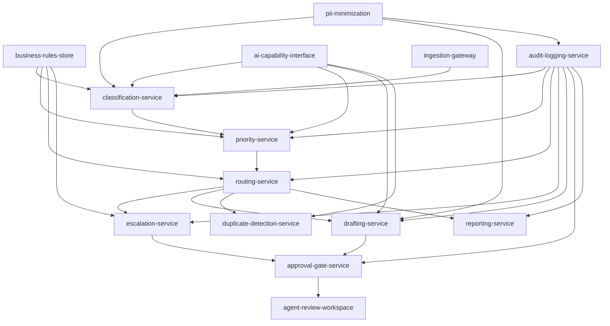

# Implementation Plan — Customer Support Email Automation

| Property            | Value                                                                                                     |
| -------------------- | ------------------------------------------------------------------------------------------------------------ |
| Case Study            | [Customer Support Email Automation](../README.md)                                                         |
| Work Order            | [WO-104 — Customer Support Implementation](../../../work-orders/delivery/WO-104-Customer-Support-Implementation.md) |
| Source Architecture   | [Solution Architecture](../architecture/solution-architecture.md)                                          |
| Source Requirements   | [Requirements Specification](../requirements/requirements-specification.md)                                |
| Source Discovery      | [Discovery Document](../discovery/discovery-document.md)                                                   |
| Prepared By           | AI Software Engineer                                                                                        |
| ACM Phase             | Modernize                                                                                                    |
| Status                | Draft — Pending Client Review                                                                                |
| Version               | 1.0                                                                                                           |
| Date                  | 2026-08-03                                                                                                    |

---

## Table of Contents

- [1. Executive Summary](#1-executive-summary)
- [2. Engineering Objectives](#2-engineering-objectives)
- [3. Repository Strategy](#3-repository-strategy)
- [4. Service Decomposition](#4-service-decomposition)
- [5. Proposed Repository Structure](#5-proposed-repository-structure)
- [6. Development Standards](#6-development-standards)
- [7. API Strategy](#7-api-strategy)
- [8. Database Strategy](#8-database-strategy)
- [9. Event-Driven Communication Strategy](#9-event-driven-communication-strategy)
- [10. Security Implementation Strategy](#10-security-implementation-strategy)
- [11. Testing Strategy](#11-testing-strategy)
- [12. CI/CD Strategy](#12-cicd-strategy)
- [13. Sprint Plan](#13-sprint-plan)
- [14. Engineering Backlog](#14-engineering-backlog)
- [15. Dependency Graph](#15-dependency-graph)
- [16. Delivery Roadmap](#16-delivery-roadmap)
- [17. Risks](#17-risks)
- [18. Engineering Handoff](#18-engineering-handoff)

---

## 1. Executive Summary

This Implementation Plan describes **how** Engineering will build the [Solution Architecture](../architecture/solution-architecture.md) approved under WO-103 — it does not implement it. It translates the architecture's logical services, ADRs, and non-negotiable controls into a repository strategy, service decomposition, engineering standards, delivery sequencing, and backlog that a development team can execute against directly.

Three commitments from the architecture carry through unchanged into every section below:

1. **The Human Approval Gate and PII Minimization Boundary are shared, mandatory components** (Architecture §10, ADR-003) — every service plan in this document routes customer-facing or PII-bearing paths through them; no service is planned to bypass them.
2. **Business rules (priority, routing, escalation, "sensitive") are externalized, not hard-coded** (Architecture §6, ADR-004) — the Business Rules Store is planned as one of the first components built, ahead of the triage services that depend on it.
3. **Rollout is staged — shadow mode first** (Architecture §11, ADR-007) — the Sprint Plan and Delivery Roadmap sequence work so that classification and priority can run and be measured before any automated action is taken, and before drafting is enabled.

**This document contains no production source code and no infrastructure-as-code.** Repository layout, API contracts, database schema strategy, and CI/CD pipeline stages are described structurally; none are implemented here. Where the architecture left an item open (business rule definitions, baseline metrics, the existing platform's integration capability, peak volume, PII retention period), this plan treats it as an open dependency, not an assumption — see [Section 17](#17-risks).

---

## 2. Engineering Objectives

| Objective                                                                                          | Traces to                          |
| ---------------------------------------------------------------------------------------------------- | -------------------------------------- |
| Implement each logical architecture component as an independently deployable service                 | Architecture §6 (Logical Architecture)  |
| Implement the Human Approval Gate and PII Minimization Boundary as shared components used by every service that can touch a customer-facing action or PII | Architecture §10, ADR-003              |
| Build the Business Rules Store before any service that depends on it, and make rule changes effective without redeployment | FR-06, FR-09, NFR-08, ADR-004          |
| Sequence delivery so shadow-mode triage ships before automated action, and before response drafting   | ADR-007, Requirements §15               |
| Instrument every service so the Success Metrics baselines (FRT, ART, CSAT, cost per ticket) can be captured during shadow mode | Architecture §13 (Observability)        |
| Preserve full traceability from each engineering backlog item back to a requirement ID                | Requirements §13 (Traceability)         |
| Integrate additively with the existing support platform — build nothing that assumes its replacement  | BR-13, NFR-10                           |

---

## 3. Repository Strategy

**Decision: a single monorepo, organized as independently buildable and deployable modules, rather than one repository per service.**

**Rationale:** the architecture defines ten-plus services that are still in their first release and share several cross-cutting concerns — the AI Capability Interface, the Business Rules Store client, and the PII Minimization Boundary must be used identically by every service that touches AI output or PII (Architecture §10, §14). A monorepo lets those shared libraries be versioned, reviewed, and consumed atomically across all services during a phase where they are still evolving quickly, without the coordination overhead of publishing and bumping versions across a dozen separate repositories. This is a direct application of the persona's "minimize unnecessary complexity" principle and the architecture's "minimal necessary complexity" principle applied to engineering process, not just runtime design.

**Explicit non-goal:** this is not a permanent architectural commitment. If and when individual services scale to independent teams with different release cadences, splitting the drafting or reporting services out into their own repositories is a reasonable future evolution — the module boundaries proposed in [Section 5](#5-proposed-repository-structure) are drawn so that split is mechanical, not a redesign.

**Branching model:** trunk-based development with short-lived feature branches, merged to `main` behind pull request review (see [Section 6](#6-development-standards)). Release branches are cut only if a staged rollout (per [Section 16](#16-delivery-roadmap)) requires stabilizing one release while development continues on the next.

---

## 4. Service Decomposition

Each logical component from the Solution Architecture becomes one deployable engineering service or shared library. Priority is inherited unchanged from the Requirements Specification's MoSCoW classification (Requirements §5) — engineering does not re-prioritize.

| # | Service / Module                     | Type            | Priority     | Architecture Component                     | Key Requirements        |
| - | ---------------------------------------- | ------------------ | -------------- | ----------------------------------------------- | ---------------------------- |
| 1 | `ingestion-gateway`                        | Service              | Must Have      | Email Event Gateway + Ingestion Queue             | NFR-02, NFR-10                |
| 2 | `classification-service`                    | Service              | Must Have      | Classification Service                            | FR-01–FR-03                    |
| 3 | `priority-service`                          | Service              | Must Have      | Priority & Urgency Service                        | FR-04–FR-06                    |
| 4 | `routing-service`                           | Service              | Must Have      | Routing Service                                   | FR-07–FR-09                    |
| 5 | `escalation-service`                        | Service              | Should/Must*    | Escalation Service                                | FR-10 (Should), FR-11 (Must)   |
| 6 | `drafting-service`                          | Service              | Should Have    | Response Drafting Service                         | FR-12, FR-15 (Should); FR-13, FR-14 (Must) |
| 7 | `duplicate-detection-service`                | Service              | Could Have     | Duplicate Detection Service                       | FR-16, FR-17                   |
| 8 | `approval-gate-service`                      | Service (shared)     | Must Have      | Human Approval Gate                               | FR-13, FR-14, FR-22, BR-06     |
| 9 | `business-rules-store`                       | Service              | Must Have      | Business Rules Store                              | FR-06, FR-09, NFR-08            |
| 10 | `audit-logging-service`                     | Service              | Must Have      | Audit & Logging Service                           | FR-21, NFR-05                   |
| 11 | `reporting-service`                         | Service              | Should Have    | Reporting & Analytics Service                     | FR-18–FR-20, BR-10               |
| 12 | `ai-capability-interface`                    | Shared library        | Must Have      | AI Architecture abstraction (Architecture §7)     | Supports FR-01, FR-04, FR-12, FR-16 |
| 13 | `pii-minimization`                           | Shared library        | Must Have      | PII Minimization Boundary                         | FR-23, NFR-04                   |
| 14 | `agent-review-workspace`                     | Frontend application  | Must Have      | Agent Review Workspace                            | FR-13, FR-15, NFR-07              |

\* `escalation-service` mixes a Should-Have capability (FR-10, the recommendation) with a Must-Have control (FR-11, the confirmation gate) — see [Section 14](#14-engineering-backlog) for how the backlog splits this.

**Why the Approval Gate and Business Rules Store are services, not libraries:** every other shared concern (AI Capability Interface, PII Minimization) is stateless logic and ships as a library embedded in each service. The Approval Gate and Business Rules Store hold state (pending approvals; current rule definitions) that must be consistent across every service that reads or writes it, so they are deployed as their own services with their own datastore, consistent with the architecture's depiction of them as first-class components (Architecture §6).

---

## 5. Proposed Repository Structure

```text
customer-support-automation/
├── services/
│   ├── ingestion-gateway/
│   ├── classification-service/
│   ├── priority-service/
│   ├── routing-service/
│   ├── escalation-service/
│   ├── drafting-service/
│   ├── duplicate-detection-service/
│   ├── approval-gate-service/
│   ├── business-rules-store/
│   ├── audit-logging-service/
│   └── reporting-service/
├── libs/
│   ├── ai-capability-interface/
│   ├── pii-minimization/
│   ├── business-rules-client/
│   └── event-contracts/
├── web/
│   └── agent-review-workspace/
├── contracts/
│   └── openapi/
├── docs/
│   └── adr/
├── infra/
└── .github/
    └── workflows/
```

**Notes on this structure:**

- Each entry under `services/` is an independently buildable and deployable module (Spring Boot, per the case study's Technology Direction), consuming the shared libraries under `libs/` rather than duplicating AI-calling or PII-handling logic.
- `contracts/openapi/` holds the API contract definitions described in [Section 7](#7-api-strategy) — contracts are authored and reviewed before the services that implement them, not generated from code after the fact.
- `docs/adr/` is where the individual Architecture Decision Records referenced in Architecture §15 are expanded into full records during implementation.
- **`infra/` and `.github/workflows/` are structural placeholders only.** This plan defines what belongs in them ([Section 12](#12-cicd-strategy)) but does not populate them — infrastructure-as-code and pipeline definitions are explicitly out of scope for this Work Order and this document.

---

## 6. Development Standards

| Area                    | Standard                                                                                              |
| ---------------------------- | ------------------------------------------------------------------------------------------------------------- |
| Language / framework           | Java on Spring Boot for backend services, React for the Agent Review Workspace, per the case study's Technology Direction |
| Code review                    | Every change to `main` requires at least one peer review; changes touching the Approval Gate, PII Minimization library, or Business Rules Store require review from a second engineer familiar with those components specifically |
| Branching                       | Trunk-based, short-lived feature branches (see [Section 3](#3-repository-strategy))                            |
| Coding style                    | Enforced via automated linting/formatting in CI (see [Section 12](#12-cicd-strategy)); style rules are a team decision at implementation kickoff, not fixed by this plan |
| Documentation                   | Every service ships a README describing its responsibility, its requirement traceability (per [Section 4](#4-service-decomposition)), and its API contract reference |
| Architectural conformance        | No service may call another service's datastore directly, call an LLM provider SDK directly (must go through `ai-capability-interface`), or implement its own approval logic (must call `approval-gate-service`) — these are treated as architecture violations, not style preferences, per Architecture §10 |
| Technical debt                  | Tracked explicitly in the Engineering Backlog ([Section 14](#14-engineering-backlog)), not left implicit in code comments |

---

## 7. API Strategy

- **Contract-first.** Every service's API is defined in `contracts/openapi/` before implementation begins, consistent with the case study's REST APIs direction. This lets dependent services (e.g., `routing-service` depending on `classification-service`'s output shape) be built against a stable contract rather than a moving implementation.
- **Internal vs. external surface.** Internal service-to-service calls (e.g., `priority-service` reading from `business-rules-store`) are synchronous REST where an immediate answer is needed, and asynchronous events (see [Section 9](#9-event-driven-communication-strategy)) where the pipeline can proceed without waiting. The only external-facing contracts are the `ingestion-gateway`'s inbound webhook/API (receiving events from the existing support platform) and its outbound write-back API (Architecture §9).
- **Versioning.** APIs are versioned in the URL path (e.g., `/v1/...`); breaking changes require a new version, not an in-place change, since multiple services may depend on a contract at different times during rollout.
- **Confidence and abstention in every response.** Per Architecture §7, every AI-backed endpoint (classification, priority, routing, drafting, duplicate detection) returns a confidence value alongside its result, so downstream services and the Approval Gate can apply the abstention behavior required by FR-02 and FR-08 without re-deriving it.

---

## 8. Database Strategy

- **PostgreSQL, per the Technology Direction, with one schema per service** rather than one shared database — each service in [Section 4](#4-service-decomposition) owns its schema and is the only writer to it, consistent with the architecture's service independence goal (Architecture §4, "modular evolution").
- **Migrations are versioned and forward-only**, applied through a migration tool as part of each service's deployment (tool selection is an implementation-time decision, not fixed here); no manual schema changes against any environment.
- **PII handling in schema design:** tables that store email content or derived PII (primarily in `ingestion-gateway` and `drafting-service`) are designed so that the `audit-logging-service`'s schema stores decision metadata and confidence scores, not full message content, matching the architecture's data-flow description (Architecture §8) and NFR-04. Column-level encryption is applied to any field holding PII at rest.
- **Retention:** schema design includes a `retained_until` or equivalent field on any table holding PII, ready to enforce a deletion policy — but the actual retention period is a Compliance-owned business rule not yet defined (Requirements Open Question 6), so the enforcement job is planned but its schedule is not finalized until that input arrives (see [Section 17](#17-risks)).
- **Business Rules Store persistence:** rules are stored as versioned records (not overwritten in place), so that every triage decision can be traced back to the exact rule version that produced it — required for the audit trail in FR-21.

---

## 9. Event-Driven Communication Strategy

The pipeline downstream of ingestion is asynchronous and event-driven, per Architecture §6 and §12 (Scalability Strategy).

**Event types on the pipeline:**

`EmailReceived` → `EmailClassified` → `PriorityAssigned` → `RoutingDecided` → (`EscalationRecommended` | `DraftGenerated` | `DuplicateFlagged`) → `ApprovalDecided` → `ActionWrittenBack`

**Design rules:**

- **At-least-once delivery, idempotent consumers.** Every service that consumes an event must treat re-delivery as a normal case (e.g., re-processing the same `EmailReceived` event must not create a duplicate classification record) — this is a correctness requirement, not an optimization, given the volume and spike behavior described in NFR-02.
- **Event schemas are versioned contracts**, defined alongside the REST contracts in `contracts/` and reviewed the same way.
- **The Audit & Logging Service subscribes to every event type** rather than being called out-of-band by each service, so that FR-21's audit trail cannot be incomplete because one service forgot to log — this mirrors the architecture's decision to make the Approval Gate a shared, unbypassable component (ADR-003), applied here to auditability.
- **Backpressure is absorbed at the queue, not by dropping events** — consistent with Architecture §12's rationale that a synchronous pipeline would reproduce the demand-spike bottleneck Discovery identified in the manual process.

---

## 10. Security Implementation Strategy

| Control                                     | Implementation Approach                                                                                  | Traces to           |
| ------------------------------------------------ | ---------------------------------------------------------------------------------------------------------------- | ---------------------- |
| Role-based access control                          | Roles (Agent, Team Lead, Compliance Admin) enforced centrally by `approval-gate-service` and `business-rules-store`, not re-implemented per service | FR-22, NFR-06           |
| Approval Gate enforcement                          | Implemented as a callable service, not a shared code path copy-pasted into each service — any service producing a customer-facing action calls it and cannot proceed without an affirmative response | BR-06, ADR-003          |
| PII minimization                                    | `pii-minimization` library provides field-level redaction/masking helpers used by every service before data crosses a service boundary or reaches a log | FR-23, NFR-04            |
| Encryption in transit                               | TLS on all internal and external service-to-service and client-to-service calls                                    | NFR-04                    |
| Encryption at rest                                  | Column-level encryption for PII-bearing fields (per [Section 8](#8-database-strategy))                             | BR-12, NFR-04             |
| Secrets management                                  | Application secrets (API keys, DB credentials) are never committed to the repository; retrieved at runtime from a secrets manager (specific product is an infrastructure decision, out of scope here) | General security hygiene   |
| Audit logging                                       | Every service emits decision + override events to `audit-logging-service`; logs are append-only                    | FR-21, NFR-05              |

**Design note carried from the architecture:** the Approval Gate being a real service (not a shared function each team remembers to call) is the single most important security-implementation decision in this plan — it converts BR-06 from a policy expectation into something a missing pull-request review comment cannot silently break.

---

## 11. Testing Strategy

| Layer                          | What It Verifies                                                                                    |
| ----------------------------------- | ------------------------------------------------------------------------------------------------------------ |
| Unit tests                            | Per-service logic in isolation; required for every service before merge                                       |
| Contract tests                        | Every service honors its published API/event contract from `contracts/`, so dependent services can be built and tested against the contract without standing up the real dependency |
| Integration tests                     | Multi-service flows (e.g., classification → priority → routing) run against real service instances in a test environment |
| **Approval Gate bypass tests**         | A dedicated, mandatory test suite that asserts no code path can deliver a sensitive or AI-drafted response without an approval record — this suite blocks merge on failure, given BR-06's non-negotiable status |
| AI evaluation (golden-set)             | Classification, priority, and duplicate-detection accuracy measured against a curated, human-labeled set of historical-style emails, tracked over time as prompts/models change |
| Draft quality sampling                 | A sample of generated drafts reviewed by a human against defined quality criteria before drafting is enabled beyond shadow mode |
| Load / volume testing                   | Pipeline tested against the ~8,000/day volume target and a modeled spike multiplier, validating the queue-based scalability approach (NFR-02) before production rollout |
| Shadow-mode validation                  | The first production test is not a synthetic test at all — it is shadow mode itself (Architecture §11), where the system runs against real traffic and logs decisions without acting, providing the strongest possible pre-launch validation |

---

## 12. CI/CD Strategy

Pipelines run in GitHub Actions, per the Technology Direction. This section describes the pipeline's stages and gates; no workflow files are authored as part of this plan.

**Pipeline stages, in order:**

1. Lint and static analysis
2. Unit tests
3. Build (per changed service/module, not the whole monorepo, to keep CI time proportional to change size)
4. Contract tests
5. Integration tests (on a subset of services affected by the change)
6. Security scan (dependency vulnerabilities, secret scanning)
7. Container build
8. Deploy to staging
9. Automated smoke tests against staging
10. Manual approval gate for production deployment
11. Deploy to production (progressive rollout — see [Section 16](#16-delivery-roadmap) for the shadow-mode sequencing this applies to)

**Environment mapping:** development → staging → production, matching Architecture §11. Staging is where integration with a sandbox instance of the existing support platform is validated before any production write-back is enabled.

**Independent deployability:** because each service in [Section 4](#4-service-decomposition) is a separate deployable unit, the pipeline is designed to deploy one changed service at a time rather than the whole system, so that, for example, a `drafting-service` change never requires redeploying `classification-service`.

---

## 13. Sprint Plan

Sprints are grouped into three releases that mirror the architecture's shadow-mode-first sequencing (ADR-007). Sprint length and start dates are implementation-team decisions outside this plan's scope; what follows is sequencing and goals, not a calendar.

### Release 1 — Foundation and Shadow-Mode Triage

| Sprint | Goal                                                                                          |
| -------- | -------------------------------------------------------------------------------------------------- |
| 1        | Stand up repository structure, CI pipeline skeleton, `ai-capability-interface` and `pii-minimization` libraries, `business-rules-store` (empty rule set), `audit-logging-service` |
| 2        | `ingestion-gateway` (log-only, no write-back yet) and `classification-service` running in shadow mode against real event volume |
| 3        | `priority-service` in shadow mode; begin capturing FRT/classification-accuracy baseline data via `reporting-service` (minimal version) |

### Release 2 — Human-Approved Routing and Escalation

| Sprint | Goal                                                                                          |
| -------- | -------------------------------------------------------------------------------------------------- |
| 4        | `routing-service` in shadow mode, then promoted to write-back once routing rules are confirmed; `approval-gate-service` built and integrated |
| 5        | `escalation-service` (FR-10 recommendation + FR-11 mandatory confirmation); `agent-review-workspace` MVP for routing/escalation review |
| 6        | Full audit trail validation across classification → priority → routing → escalation; load testing against NFR-02 volume target |

### Release 3 — AI-Assisted Drafting and Remaining Capabilities

| Sprint | Goal                                                                                          |
| -------- | -------------------------------------------------------------------------------------------------- |
| 7        | `drafting-service` (RAG-grounded) behind the Approval Gate; draft quality sampling process live |
| 8        | `duplicate-detection-service`; `reporting-service` expanded to full Success Metrics coverage; production rollout readiness review |

---

## 14. Engineering Backlog

Backlog epics mirror the Requirements Specification's functional requirement groups (Requirements §5) so that every backlog item traces to a requirement ID.

| Epic                             | Representative Backlog Items                                                          | Priority (inherited) | Target Release |
| ------------------------------------- | -------------------------------------------------------------------------------------------- | ------------------------ | ------------------ |
| Foundation                              | Repository scaffolding; `ai-capability-interface`; `pii-minimization`; `business-rules-store` (empty); `audit-logging-service` | Must Have                 | Release 1            |
| A — Email Classification                 | Classify email (FR-01); low-confidence review flag (FR-02); human correction capture (FR-03) | Must / Should / Should      | Release 1            |
| B — Priority & Urgency                   | Assign priority (FR-04); urgent/high-risk flag (FR-05); configurable criteria (FR-06)        | Must / Must / Should         | Release 1            |
| C — Routing                              | Route to team (FR-07); low-confidence routing flag (FR-08); configurable rules (FR-09)       | Must / Should / Should       | Release 2            |
| D — Escalation                           | Escalation recommendation (FR-10); mandatory human confirmation (FR-11)                        | Should / Must                | Release 2            |
| E — Response Drafting                    | Draft generation (FR-12); mandatory approval (FR-13); sensitive-block (FR-14); reject/edit/regenerate (FR-15) | Should / Must / Must / Should | Release 3            |
| F — Duplicate Detection                  | Duplicate identification (FR-16); advisory presentation (FR-17)                                | Could / Could                | Release 3            |
| G — Reporting & Analytics                | Volume/classification/priority reporting (FR-18); routing/escalation reporting (FR-19); automation-vs-baseline reporting (FR-20) | Should / Should / Could      | Release 1 (minimal) → Release 3 (full) |
| H — Governance & Oversight               | Audit trail (FR-21); role-restricted approval (FR-22); PII exposure minimization (FR-23)      | Must / Must / Must            | Release 1–2 (built alongside the services they govern) |

**Backlog discipline:** no item is added to this backlog without a requirement ID to trace to. Any engineering-only task (e.g., "set up staging environment") is tracked as infrastructure work supporting a release, not counted against a business requirement.

---

## 15. Dependency Graph



**Reading this graph:** `business-rules-store`, `audit-logging-service`, `ai-capability-interface`, and `pii-minimization` sit at the foundation and must exist — even in minimal form — before any triage service is built, which is why they are all scoped to Sprint 1 in [Section 13](#13-sprint-plan). `approval-gate-service` must exist before `drafting-service` or `escalation-service` can be promoted beyond shadow mode, since neither is allowed to take a customer-facing action without it (BR-06).

---

## 16. Delivery Roadmap

```mermaid
gantt
    title Delivery Roadmap (sequencing, not calendar dates)
    dateFormat  X
    axisFormat %s
    section Release 1 — Foundation & Shadow Mode
    Foundation libraries & stores      :r1a, 0, 1
    Classification (shadow mode)        :r1b, after r1a, 1
    Priority (shadow mode)              :r1c, after r1b, 1
    section Release 2 — Human-Approved Routing
    Routing + Approval Gate             :r2a, after r1c, 1
    Escalation                          :r2b, after r2a, 1
    Audit validation & load testing     :r2c, after r2b, 1
    section Release 3 — AI-Assisted Drafting
    Drafting (RAG, behind Approval Gate):r3a, after r2c, 1
    Duplicate detection & full reporting:r3b, after r3a, 1
```



Each release gates the next on a validation checkpoint, not just elapsed time: Release 2 does not begin promoting routing to production write-back until classification and priority shadow-mode data confirms acceptable accuracy; Release 3 does not enable drafting beyond shadow mode until the Approval Gate has been proven under Release 2's real (if lower-stakes) approval traffic.

---

## 17. Risks

| Risk                                                                                     | Engineering Impact                                                                       | Mitigation                                                                                     |
| ---------------------------------------------------------------------------------------------- | ------------------------------------------------------------------------------------------------ | ---------------------------------------------------------------------------------------------------- |
| Existing support platform's webhook/API capability unconfirmed (Requirements Open Question 7)     | `ingestion-gateway` and the write-back path cannot be finalized                                     | Sprint 1 includes a technical spike to validate the platform's integration capability before Sprint 2's gateway work begins |
| Business rules (priority, routing, escalation, "sensitive") undefined                             | `business-rules-store` ships with no real rules; triage services have nothing to evaluate against until rules arrive | Store and API are built rule-agnostic in Sprint 1; shadow mode (Sprint 2–3) validates pipeline mechanics independent of rule content |
| RAG/LLM latency and cost at ~8,000 emails/day unmodeled                                            | `drafting-service` performance and cost could exceed assumptions at scale                          | Scheduled as Release 3, after real-world classification/priority latency data exists from Releases 1–2; small-scale cost/latency spike planned before Sprint 7 |
| Peak/spike volume not yet measured (Requirements Open Question 5)                                  | Load testing in Sprint 6 uses an assumed multiplier over the known ~8,000/day average, not a confirmed peak | Queue-based architecture (Architecture §12) reduces sensitivity to this unknown; load test assumption revisited once shadow-mode data provides a real distribution |
| PII retention period undefined (Requirements Open Question 6)                                       | Retention-enforcement job cannot be scheduled                                                       | Schema supports retention fields from Sprint 1; enforcement job implementation is deferred, not blocking other work, until Compliance provides the period |
| Team unfamiliarity with RAG-based drafting pipelines                                                | Release 3 estimate carries more uncertainty than Releases 1–2                                        | Time-boxed technical spike planned ahead of Sprint 7 to de-risk the estimate before committing to it |
| Monorepo coordination overhead as team scales                                                        | Shared library changes could become a bottleneck if many engineers work in parallel                  | Module boundaries in [Section 5](#5-proposed-repository-structure) are drawn so a future split to polyrepo is mechanical, not a redesign |

---

## 18. Engineering Handoff

This Implementation Plan, together with the Solution Architecture and Requirements Specification, is intended to let an engineering team begin Sprint 1 without re-deriving business or architectural intent. The handoff includes:

- **This document**, with the Service Decomposition ([Section 4](#4-service-decomposition)) and Dependency Graph ([Section 15](#15-dependency-graph)) as the primary sequencing reference.
- **Explicit non-negotiables restated for engineering**: no service ships that allows a sensitive or AI-drafted communication to be sent without passing through `approval-gate-service` (BR-06), and no service ships that exposes PII beyond what `pii-minimization` permits (BR-12). Engineering should treat any design that routes around either as a defect against this plan, not a valid shortcut.
- **Open items that block specific pieces of work**, restated from [Section 17](#17-risks) so they are not lost between documents: platform integration capability (blocks `ingestion-gateway` finalization), business rule definitions (blocks meaningful triage output, though not the underlying build), baseline metrics and peak volume (both being produced by shadow mode itself), and PII retention period (blocks only the retention-enforcement job, not the rest of the schema).
- **Recommended entry point**: Sprint 1 of the Sprint Plan ([Section 13](#13-sprint-plan)) — foundation libraries and stores, before any triage service work begins.

**This document does not include source code, infrastructure-as-code, or CI/CD pipeline definitions.** Those are produced during actual implementation execution, which is the work this plan prepares for but does not itself perform.
